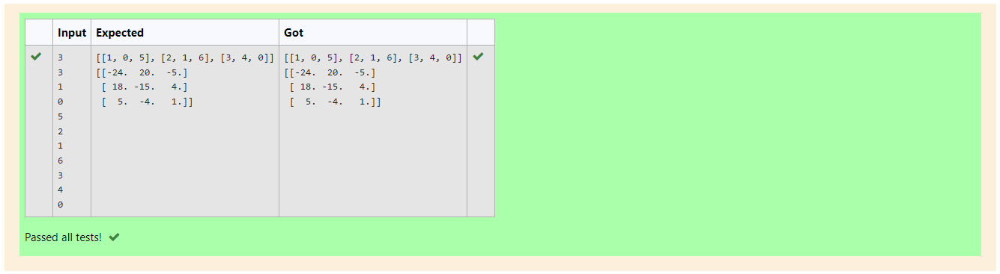

# Inverse-of-matrix

## AIM:
To write a python program to find inverse a matrix.

## ALGORITHM:
## Step 1:
Start python program.

## Step 2:
Import numpy.Create two null lists.

## Step 3:
Get the parameters and the elements from the user using for loops.

## Step 4:
Inverse the matrix using linalg library.

## Step 5:
End the program.


## PROGRAM:
```
#Developed by: Jegathish s
#Register number: 212221230041
import numpy as np
n=int(input())
m=int(input())
list1=[]
for i in range(n):
    row=[]
    for j in range(m):
        row.append(int(input()))
    list1.append(row)
print(list1)
a=np.linalg.inv(list1)
print(a)
```
## OUTPUT:

## RESULT:
Thus python program to find inverse of matrix is done.
